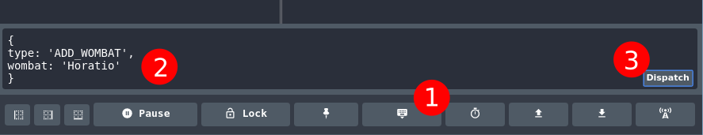

# Redux with React (but not the clean way)

This repo aims to help you experiment with Redux using an atypical React setup (we'll improve how we integrate with React in a later exercise). After cloning this repo:

```shell
yarn
yarn start
```

This will start a [Webpack dev server](https://github.com/webpack/webpack-dev-server). Open [http://localhost:8080](http://localhost:8080) in your browser.


## Redux DevTools

Install the Firefox add-on [here](https://addons.mozilla.org/en-US/firefox/addon/remotedev/) and the Chrome extension from [here](https://chrome.google.com/webstore/detail/redux-devtools/lmhkpmbekcpmknklioeibfkpmmfibljd).


## Exercise

### Using Redux DevTools

Load up Redux DevTools and dispatch a few `ADD_WOMBAT` and `DEL_WOMBAT` actions to see what's going on. This screenshot illustrates how to dispatch actions:




### Write some code

- Starting with your `index.js`, follow the *chain* from the **render** function all the way through to the `Wombats.jsx` file. Be sure to take note of the **props** being passed down the chain.

- Add an `UPDATE_WOMBAT` action to the reducer in `reducer.js`. Take your time to read through what the reducer currently does, and follow the established pattern to create your new action.

To update a wombat you will need to provide the **new** name of the wombat (so that it can be changed) but also the **old** name (so that the reducer can find the wombat that needs to be updated).

Make sure you can dispatch this new action successfully from Redux DevTools. You'll dispatch this action from code in a later step.


#### Delete a Wombat

Add a delete button next to each of the wombats so they can be deleted:

- Modify the `Wombats.jsx` component to add a button next to each of the wombats.
- Add an event listener to handle an `onClick` event.
- In the event listener, [`dispatch`](http://redux.js.org/docs/api/Store.html#dispatch) a `DEL_WOMBAT` action to the store to delete the wombat based on its name.
- **Important!** Make sure that:
  1. You can refer to the `dispatch` function from the `Wombats.jsx` file.
  2. Ensure that the `DEL_WOMBAT` action works from Redux DevTools before making it work through your code.
  3. The correct action is being dispatched from your code on the click event. You could use a function to *produce* an action: these are called *action creators*.


#### Add a Wombat

- Add a simple input field to the page with a button to add a wombat.
- Add an event listener to handle the button's `onClick` event.
- Wire up this input so that it can `dispatch` an `ADD_WOMBAT` action to the store to add the wombat's name from the input box.
- It may be worth referring to the recommended problem solving steps above.


#### Update a Wombat

- Modify the `Wombats.jsx` component to add an input box and a button next to each of the wombats.
- Add an event to this new input/button upon submission.
- Looking back at your `UPDATE_WOMBAT` action, it expected both the **new** and **old** name of the wombat, so make sure that you can provide both of these values when you dispatch your action.
- `dispatch` the action to the store to change the name of the wombat.


#### Add a new type of animal

- Add a new reducer function for another property on the Redux store. We already have `wombats`; how about `aardvarks`?
- Add some actions to the new reducer.
- Add another rendering function in `index.js` to handle the new property on the store, and subscribe it to the store using the same method as `wombats`.


## See also

When you're starting to get happier with this process, you could try reinforcing it with the [Getting Started with Redux](https://egghead.io/courses/getting-started-with-redux) video tutorials from Redux creator Dan Abramov.
